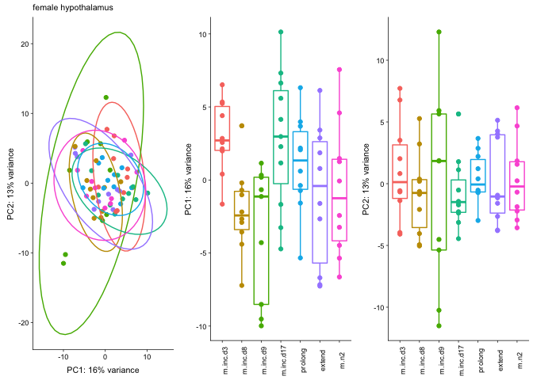
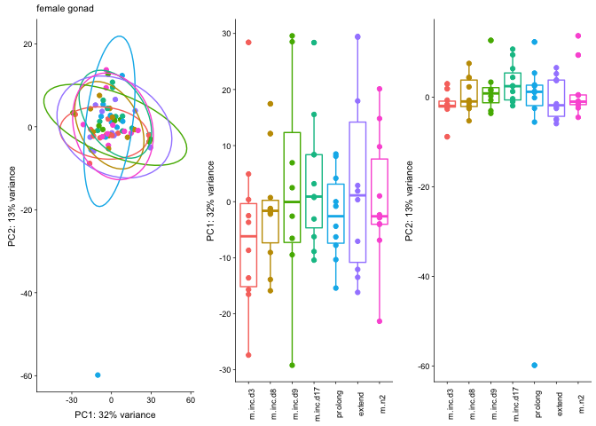
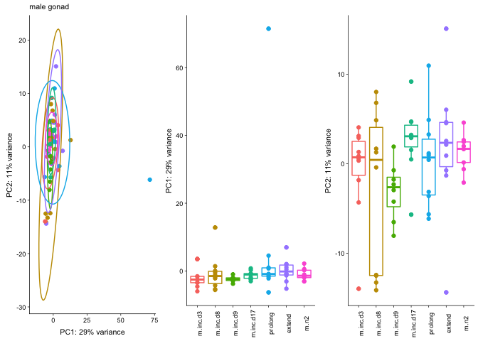
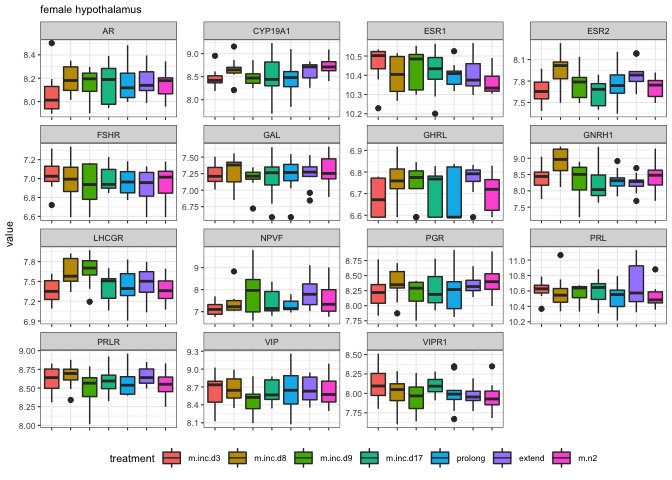
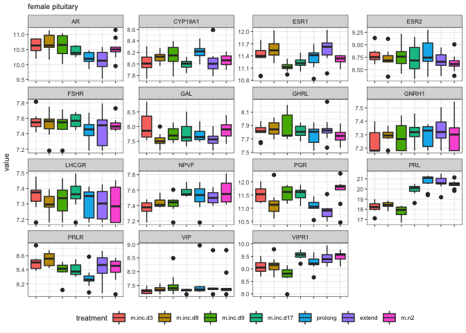
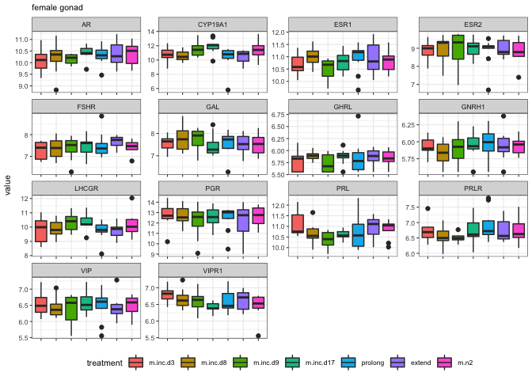
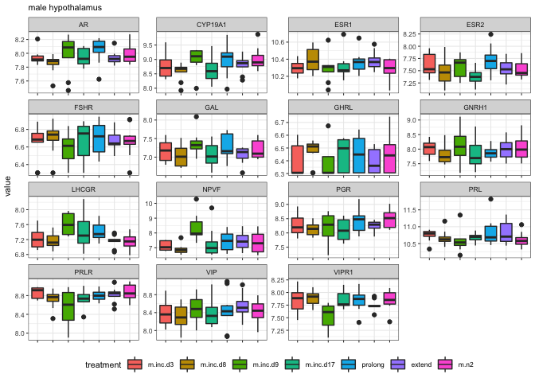
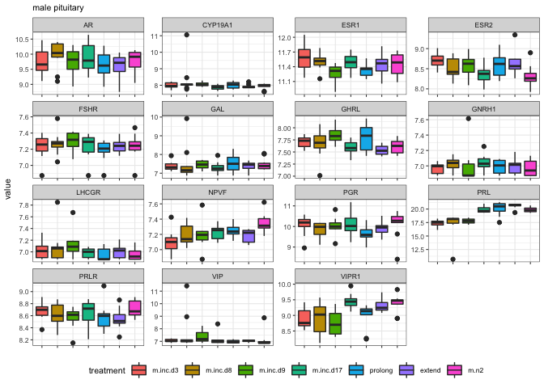

    library(tidyverse)
    library(DESeq2)
    library(cowplot)
    library(RColorBrewer)
    library(pheatmap)
    library(kableExtra)
    library(viridis)

    # load custom functions  
    source("../R/functions.R") 

    knitr::opts_chunk$set(fig.path = '../figures/manipulation/', cache = TRUE)

Manipulation data
-----------------

    # import "colData" which contains sample information and "countData" which contains read counts
    m.colData <- read.csv("../metadata/00_colData_manipluation.csv", header = T, row.names = 1)
    m.countData <- read.csv("../results/00_countData_manipluation.csv", header = T, row.names = 1)
    geneinfo <- read.csv("../metadata/00_geneinfo.csv", row.names = 1)

    # set levels
    m.colData$treatment <- factor(m.colData$treatment, levels = 
                                  c("m.inc.d3",  "m.inc.d8",
                                    "m.inc.d9", "m.inc.d17",
                                    "prolong", "extend", "m.n2"))

    m.colData$sextissue <- as.factor(paste(m.colData$sex, m.colData$tissue, sep = "_"))

    m.colData$outcome <- ifelse(grepl("d3|d9|d17", m.colData$treatment), "end inc", 
                         ifelse(grepl("d8|n2", m.colData$treatment),"end hatch",
                         ifelse(grepl("prolong", m.colData$treatment),"prolong inc",
                         ifelse(grepl("extend", m.colData$treatment),"delay hatch", NA))))

    m.colData$outcome <- factor(m.colData$outcome, levels = 
                                  c("end inc",  "end hatch",
                                    "prolong inc", "delay hatch"))
    summary(m.colData[c(7,3,4,5,8,9)])

    ##           study         sex               tissue        treatment 
    ##  manipulation:411   female:208   gonad       :136   m.inc.d3 :60  
    ##                     male  :203   hypothalamus:138   m.inc.d8 :60  
    ##                                  pituitary   :137   m.inc.d9 :49  
    ##                                                     m.inc.d17:63  
    ##                                                     prolong  :60  
    ##                                                     extend   :60  
    ##                                                     m.n2     :59  
    ##                sextissue         outcome   
    ##  female_gonad       :69   end inc    :172  
    ##  female_hypothalamus:70   end hatch  :119  
    ##  female_pituitary   :69   prolong inc: 60  
    ##  male_gonad         :67   delay hatch: 60  
    ##  male_hypothalamus  :68                    
    ##  male_pituitary     :68                    
    ## 

Run DESeq on all subsets of the data
------------------------------------

    dds.female_hypothalamus <- subsetDESeq("female_hypothalamus")

    ## [1] TRUE
    ## class: DESeqDataSet 
    ## dim: 14937 70 
    ## metadata(1): version
    ## assays(1): counts
    ## rownames(14937): NP_001001127.1 NP_001001129.1 ... XP_430449.2
    ##   XP_430508.3
    ## rowData names(0):
    ## colnames(70): blk.s031.pu.d_female_hypothalamus_prolong
    ##   blk.s032.g.w_female_hypothalamus_m.hatch ...
    ##   y85.r71.x_female_hypothalamus_m.inc.d17
    ##   y98.g54_female_hypothalamus_m.hatch
    ## colData names(9): V1 bird ... sextissue outcome
    ## [1] 14363    70

    ## estimating size factors

    ## estimating dispersions

    ## gene-wise dispersion estimates

    ## mean-dispersion relationship

    ## final dispersion estimates

    ## fitting model and testing

    ## -- replacing outliers and refitting for 15 genes
    ## -- DESeq argument 'minReplicatesForReplace' = 7 
    ## -- original counts are preserved in counts(dds)

    ## estimating dispersions

    ## fitting model and testing

    dds.female_pituitary <- subsetDESeq("female_pituitary" )

    ## [1] TRUE
    ## class: DESeqDataSet 
    ## dim: 14937 69 
    ## metadata(1): version
    ## assays(1): counts
    ## rownames(14937): NP_001001127.1 NP_001001129.1 ... XP_430449.2
    ##   XP_430508.3
    ## rowData names(0):
    ## colnames(69): blk.s031.pu.d_female_pituitary_prolong
    ##   blk.s032.g.w_female_pituitary_m.hatch ...
    ##   y85.r71.x_female_pituitary_m.inc.d17
    ##   y98.g54_female_pituitary_m.hatch
    ## colData names(9): V1 bird ... sextissue outcome
    ## [1] 14298    69

    ## estimating size factors

    ## estimating dispersions

    ## gene-wise dispersion estimates

    ## mean-dispersion relationship

    ## final dispersion estimates

    ## fitting model and testing

    ## -- replacing outliers and refitting for 54 genes
    ## -- DESeq argument 'minReplicatesForReplace' = 7 
    ## -- original counts are preserved in counts(dds)

    ## estimating dispersions

    ## fitting model and testing

    dds.female_gonad <- subsetDESeq("female_gonad" )

    ## [1] TRUE
    ## class: DESeqDataSet 
    ## dim: 14937 69 
    ## metadata(1): version
    ## assays(1): counts
    ## rownames(14937): NP_001001127.1 NP_001001129.1 ... XP_430449.2
    ##   XP_430508.3
    ## rowData names(0):
    ## colnames(69): blk.s031.pu.d_female_gonad_prolong
    ##   blk.s032.g.w_female_gonad_m.hatch ...
    ##   y85.r71.x_female_gonad_m.inc.d17 y98.g54_female_gonad_m.hatch
    ## colData names(9): V1 bird ... sextissue outcome
    ## [1] 14631    69

    ## estimating size factors

    ## estimating dispersions

    ## gene-wise dispersion estimates

    ## mean-dispersion relationship

    ## final dispersion estimates

    ## fitting model and testing

    ## -- replacing outliers and refitting for 472 genes
    ## -- DESeq argument 'minReplicatesForReplace' = 7 
    ## -- original counts are preserved in counts(dds)

    ## estimating dispersions

    ## fitting model and testing

    dds.male_hypothalamus <- subsetDESeq("male_hypothalamus" )

    ## [1] TRUE
    ## class: DESeqDataSet 
    ## dim: 14937 68 
    ## metadata(1): version
    ## assays(1): counts
    ## rownames(14937): NP_001001127.1 NP_001001129.1 ... XP_430449.2
    ##   XP_430508.3
    ## rowData names(0):
    ## colnames(68): blk.s030.o.g_male_hypothalamus_prolong
    ##   blk5.x_male_hypothalamus_m.inc.d3 ...
    ##   y55.x_male_hypothalamus_m.inc.d8
    ##   y63.x_male_hypothalamus_m.inc.d9
    ## colData names(9): V1 bird ... sextissue outcome
    ## [1] 14339    68

    ## estimating size factors

    ## estimating dispersions

    ## gene-wise dispersion estimates

    ## mean-dispersion relationship

    ## final dispersion estimates

    ## fitting model and testing

    ## -- replacing outliers and refitting for 7 genes
    ## -- DESeq argument 'minReplicatesForReplace' = 7 
    ## -- original counts are preserved in counts(dds)

    ## estimating dispersions

    ## fitting model and testing

    dds.male_pituitary <- subsetDESeq("male_pituitary"  )

    ## [1] TRUE
    ## class: DESeqDataSet 
    ## dim: 14937 68 
    ## metadata(1): version
    ## assays(1): counts
    ## rownames(14937): NP_001001127.1 NP_001001129.1 ... XP_430449.2
    ##   XP_430508.3
    ## rowData names(0):
    ## colnames(68): blk.s030.o.g_male_pituitary_prolong
    ##   blk5.x_male_pituitary_m.inc.d3 ... y55.x_male_pituitary_m.inc.d8
    ##   y63.x_male_pituitary_m.inc.d9
    ## colData names(9): V1 bird ... sextissue outcome
    ## [1] 14288    68

    ## estimating size factors

    ## estimating dispersions

    ## gene-wise dispersion estimates

    ## mean-dispersion relationship

    ## final dispersion estimates

    ## fitting model and testing

    ## -- replacing outliers and refitting for 211 genes
    ## -- DESeq argument 'minReplicatesForReplace' = 7 
    ## -- original counts are preserved in counts(dds)

    ## estimating dispersions

    ## fitting model and testing

    dds.male_gondad <- subsetDESeq("male_gonad")

    ## [1] TRUE
    ## class: DESeqDataSet 
    ## dim: 14937 67 
    ## metadata(1): version
    ## assays(1): counts
    ## rownames(14937): NP_001001127.1 NP_001001129.1 ... XP_430449.2
    ##   XP_430508.3
    ## rowData names(0):
    ## colnames(67): blk.s030.o.g_male_gonad_prolong
    ##   blk5.x_male_gonad_m.inc.d3 ... y55.x_male_gonad_m.inc.d8
    ##   y63.x_male_gonad_m.inc.d9
    ## colData names(9): V1 bird ... sextissue outcome
    ## [1] 14662    67

    ## estimating size factors

    ## estimating dispersions

    ## gene-wise dispersion estimates

    ## mean-dispersion relationship

    ## final dispersion estimates

    ## fitting model and testing

    ## -- replacing outliers and refitting for 455 genes
    ## -- DESeq argument 'minReplicatesForReplace' = 7 
    ## -- original counts are preserved in counts(dds)

    ## estimating dispersions

    ## fitting model and testing

Calculate and plot total DEGs
-----------------------------

    #create list of groups for deseq contrasts
    group1 <- c("m.inc.d3","m.inc.d8", "m.inc.d9", "m.inc.d17", "prolong","extend", "m.n2" ) 
    group2 <- group1

    a <- plottotalDEGs(dds.female_hypothalamus, "female hypothalamus")
    b <- plottotalDEGs(dds.female_pituitary, "female pituitary")
    c <- plottotalDEGs(dds.female_gonad, "female gonad")
    d <- plottotalDEGs(dds.male_hypothalamus, "male hypothalamus")
    e <- plottotalDEGs(dds.male_pituitary, "male pituitary")
    f <- plottotalDEGs(dds.male_gondad, "male gonad")

    plot_grid(a,b,c,d,e,f, nrow = 2)

Calculate and plot principal components
---------------------------------------

    #mydds <- list(ddsmale_hypothalamus) # for testing only
    mydds <- list(dds.female_hypothalamus, dds.female_pituitary, dds.female_gonad,
                 dds.male_hypothalamus, dds.male_pituitary, dds.male_gondad)

    for (eachdds in mydds){
      
      vsd <- vst(eachdds, blind=FALSE) # variance stabilized 
      
      # create the dataframe using my function pcadataframe
      pcadata <- pcadataframe(vsd, intgroup=c("treatment"), returnData=TRUE)
      percentVar <- round(100 * attr(pcadata, "percentVar"))
      print(percentVar)
      

      pca1 <- ggplot(pcadata, aes(treatment, PC1,color = treatment)) + 
        geom_boxplot() +
        ylab(paste0("PC1: ", percentVar[1],"% variance")) +
        xlab(NULL) +
        theme_cowplot(font_size = 8, line_size = 0.25) +
        labs(subtitle = "eachgroup") +
        theme(legend.position = "none")

      pca2 <- ggplot(pcadata, aes(treatment, PC2,color = treatment)) + 
        geom_boxplot() +
        ylab(paste0("PC2: ", percentVar[2],"% variance")) +
        xlab(NULL) +
        theme_cowplot(font_size = 8, line_size = 0.25) +
        labs(subtitle = "eachgroup") +
        theme(legend.position = "none")

      mypca <- plot_grid(pca1, pca2)
      plot(mypca)

      print(summary(aov(PC1 ~ treatment, data=pcadata)))
      print(TukeyHSD(aov(PC1 ~ treatment, data=pcadata), which = "treatment"))
      
      print(summary(aov(PC2 ~ treatment, data=pcadata))) 
      print(summary(aov(PC3 ~ treatment, data=pcadata))) 
      print(summary(aov(PC4 ~ treatment, data=pcadata))) 

    }

    ## [1] 16 13  6  4  3  3

    ##             Df Sum Sq Mean Sq F value  Pr(>F)   
    ## treatment    6  363.3   60.55    3.79 0.00276 **
    ## Residuals   63 1006.6   15.98                   
    ## ---
    ## Signif. codes:  0 '***' 0.001 '**' 0.01 '*' 0.05 '.' 0.1 ' ' 1
    ##   Tukey multiple comparisons of means
    ##     95% family-wise confidence level
    ## 
    ## Fit: aov(formula = PC1 ~ treatment, data = pcadata)
    ## 
    ## $treatment
    ##                          diff         lwr        upr     p adj
    ## m.inc.d8-m.inc.d3  -5.0942325 -10.5385821  0.3501171 0.0813383
    ## m.inc.d9-m.inc.d3  -6.5849057 -12.1784432 -0.9913682 0.0111200
    ## m.inc.d17-m.inc.d3 -0.1976769  -5.5168523  5.1214985 0.9999998
    ## prolong-m.inc.d3   -1.8991076  -7.3434572  3.5452420 0.9366242
    ## extend-m.inc.d3    -4.0123461  -9.4566957  1.4320035 0.2873631
    ## m.n2-m.inc.d3      -3.7128220  -9.1571717  1.7315276 0.3787481
    ## m.inc.d9-m.inc.d8  -1.4906732  -7.0842107  4.1028643 0.9829231
    ## m.inc.d17-m.inc.d8  4.8965557  -0.4226197 10.2157311 0.0907475
    ## prolong-m.inc.d8    3.1951249  -2.2492247  8.6394745 0.5613373
    ## extend-m.inc.d8     1.0818864  -4.3624632  6.5262360 0.9964289
    ## m.n2-m.inc.d8       1.3814105  -4.0629391  6.8257601 0.9867495
    ## m.inc.d17-m.inc.d9  6.3872288   0.9154516 11.8590061 0.0121655
    ## prolong-m.inc.d9    4.6857981  -0.9077394 10.2793356 0.1591248
    ## extend-m.inc.d9     2.5725596  -3.0209779  8.1660971 0.7993992
    ## m.n2-m.inc.d9       2.8720837  -2.7214538  8.4656212 0.7053035
    ## prolong-m.inc.d17  -1.7014307  -7.0206061  3.6177447 0.9577472
    ## extend-m.inc.d17   -3.8146693  -9.1338447  1.5045061 0.3186775
    ## m.n2-m.inc.d17     -3.5151452  -8.8343206  1.8040302 0.4172058
    ## extend-prolong     -2.1132385  -7.5575881  3.3311111 0.8982755
    ## m.n2-prolong       -1.8137145  -7.2580641  3.6306352 0.9487835
    ## m.n2-extend         0.2995241  -5.1448255  5.7438737 0.9999980
    ## 
    ##             Df Sum Sq Mean Sq F value Pr(>F)
    ## treatment    6   31.1   5.185   0.302  0.934
    ## Residuals   63 1082.0  17.175               
    ##             Df Sum Sq Mean Sq F value  Pr(>F)   
    ## treatment    6  126.7  21.114   3.736 0.00305 **
    ## Residuals   63  356.0   5.652                   
    ## ---
    ## Signif. codes:  0 '***' 0.001 '**' 0.01 '*' 0.05 '.' 0.1 ' ' 1
    ##             Df Sum Sq Mean Sq F value Pr(>F)
    ## treatment    6  28.82   4.803   1.098  0.374
    ## Residuals   63 275.68   4.376               
    ## [1] 15 11  6  4  3  3

    ##             Df Sum Sq Mean Sq F value   Pr(>F)    
    ## treatment    6 1024.1  170.68   20.77 3.55e-13 ***
    ## Residuals   62  509.5    8.22                     
    ## ---
    ## Signif. codes:  0 '***' 0.001 '**' 0.01 '*' 0.05 '.' 0.1 ' ' 1
    ##   Tukey multiple comparisons of means
    ##     95% family-wise confidence level
    ## 
    ## Fit: aov(formula = PC1 ~ treatment, data = pcadata)
    ## 
    ## $treatment
    ##                           diff         lwr        upr     p adj
    ## m.inc.d8-m.inc.d3   -3.6365165  -7.5429727  0.2699397 0.0841748
    ## m.inc.d9-m.inc.d3    1.8040484  -2.3393741  5.9474709 0.8367837
    ## m.inc.d17-m.inc.d3   1.2658951  -2.5507454  5.0825357 0.9496712
    ## prolong-m.inc.d3    -6.2041811 -10.1106372 -2.2977249 0.0001759
    ## extend-m.inc.d3     -8.9567675 -12.8632236 -5.0503113 0.0000000
    ## m.n2-m.inc.d3        0.5894918  -3.3169644  4.4959480 0.9992352
    ## m.inc.d9-m.inc.d8    5.4405649   1.2971424  9.5839874 0.0030877
    ## m.inc.d17-m.inc.d8   4.9024116   1.0857710  8.7190522 0.0040791
    ## prolong-m.inc.d8    -2.5676646  -6.4741208  1.3387916 0.4233552
    ## extend-m.inc.d8     -5.3202510  -9.2267072 -1.4137948 0.0019004
    ## m.n2-m.inc.d8        4.2260083   0.3195521  8.1324645 0.0257067
    ## m.inc.d17-m.inc.d9  -0.5381533  -4.5970072  3.5207007 0.9996362
    ## prolong-m.inc.d9    -8.0082295 -12.1516520 -3.8648070 0.0000035
    ## extend-m.inc.d9    -10.7608159 -14.9042384 -6.6173934 0.0000000
    ## m.n2-m.inc.d9       -1.2145566  -5.3579791  2.9288659 0.9722904
    ## prolong-m.inc.d17   -7.4700762 -11.2867168 -3.6534356 0.0000026
    ## extend-m.inc.d17   -10.2226626 -14.0393032 -6.4060220 0.0000000
    ## m.n2-m.inc.d17      -0.6764033  -4.4930439  3.1402373 0.9981010
    ## extend-prolong      -2.7525864  -6.6590426  1.1538698 0.3390265
    ## m.n2-prolong         6.7936729   2.8872167 10.7001291 0.0000327
    ## m.n2-extend          9.5462593   5.6398031 13.4527155 0.0000000
    ## 
    ##             Df Sum Sq Mean Sq F value   Pr(>F)    
    ## treatment    6  507.6    84.6   8.718 6.91e-07 ***
    ## Residuals   62  601.7     9.7                     
    ## ---
    ## Signif. codes:  0 '***' 0.001 '**' 0.01 '*' 0.05 '.' 0.1 ' ' 1
    ##             Df Sum Sq Mean Sq F value   Pr(>F)    
    ## treatment    6  223.7   37.28   5.525 0.000123 ***
    ## Residuals   62  418.4    6.75                     
    ## ---
    ## Signif. codes:  0 '***' 0.001 '**' 0.01 '*' 0.05 '.' 0.1 ' ' 1
    ##             Df Sum Sq Mean Sq F value Pr(>F)
    ## treatment    6   18.9   3.153   0.487  0.816
    ## Residuals   62  401.5   6.476               
    ## [1] 32 13  9  7  4  4

    ##             Df Sum Sq Mean Sq F value Pr(>F)
    ## treatment    6    661   110.2   0.595  0.733
    ## Residuals   62  11479   185.1               
    ##   Tukey multiple comparisons of means
    ##     95% family-wise confidence level
    ## 
    ## Fit: aov(formula = PC1 ~ treatment, data = pcadata)
    ## 
    ## $treatment
    ##                           diff        lwr      upr     p adj
    ## m.inc.d8-m.inc.d3   3.91185069 -14.630440 22.45414 0.9950261
    ## m.inc.d9-m.inc.d3   7.90195769 -11.765112 27.56903 0.8820001
    ## m.inc.d17-m.inc.d3  8.78832236  -9.327652 26.90430 0.7563952
    ## prolong-m.inc.d3    3.00794134 -15.534350 21.55023 0.9988462
    ## extend-m.inc.d3     8.74359001  -9.798701 27.28588 0.7797508
    ## m.n2-m.inc.d3       5.86765463 -12.674636 24.40995 0.9597389
    ## m.inc.d9-m.inc.d8   3.99010701 -15.676963 23.65718 0.9959820
    ## m.inc.d17-m.inc.d8  4.87647167 -13.239503 22.99245 0.9819606
    ## prolong-m.inc.d8   -0.90390935 -19.446200 17.63838 0.9999990
    ## extend-m.inc.d8     4.83173932 -13.710552 23.37403 0.9847325
    ## m.n2-m.inc.d8       1.95580394 -16.586487 20.49810 0.9999039
    ## m.inc.d17-m.inc.d9  0.88636466 -18.379294 20.15202 0.9999993
    ## prolong-m.inc.d9   -4.89401635 -24.561086 14.77305 0.9879850
    ## extend-m.inc.d9     0.84163232 -18.825437 20.50870 0.9999995
    ## m.n2-m.inc.d9      -2.03430307 -21.701373 17.63277 0.9999143
    ## prolong-m.inc.d17  -5.78038102 -23.896356 12.33559 0.9581106
    ## extend-m.inc.d17   -0.04473234 -18.160707 18.07124 1.0000000
    ## m.n2-m.inc.d17     -2.92066773 -21.036642 15.19531 0.9988859
    ## extend-prolong      5.73564867 -12.806642 24.27794 0.9639253
    ## m.n2-prolong        2.85971329 -15.682578 21.40200 0.9991341
    ## m.n2-extend        -2.87593538 -21.418226 15.66636 0.9991057
    ## 
    ##             Df Sum Sq Mean Sq F value Pr(>F)
    ## treatment    6    347   57.76   0.758  0.606
    ## Residuals   62   4725   76.22               
    ##             Df Sum Sq Mean Sq F value Pr(>F)  
    ## treatment    6  614.8  102.46   2.386 0.0387 *
    ## Residuals   62 2662.0   42.94                 
    ## ---
    ## Signif. codes:  0 '***' 0.001 '**' 0.01 '*' 0.05 '.' 0.1 ' ' 1
    ##             Df Sum Sq Mean Sq F value Pr(>F)
    ## treatment    6   97.8   16.30   0.393  0.881
    ## Residuals   62 2573.9   41.51               
    ## [1] 21  9  6  5  3  3

    ##             Df Sum Sq Mean Sq F value   Pr(>F)    
    ## treatment    6  672.9  112.15   5.567 0.000118 ***
    ## Residuals   61 1228.8   20.14                     
    ## ---
    ## Signif. codes:  0 '***' 0.001 '**' 0.01 '*' 0.05 '.' 0.1 ' ' 1
    ##   Tukey multiple comparisons of means
    ##     95% family-wise confidence level
    ## 
    ## Fit: aov(formula = PC1 ~ treatment, data = pcadata)
    ## 
    ## $treatment
    ##                          diff        lwr        upr     p adj
    ## m.inc.d8-m.inc.d3  -2.9425407  -9.062077  3.1769957 0.7633728
    ## m.inc.d9-m.inc.d3   8.4818829   1.991134 14.9726314 0.0033023
    ## m.inc.d17-m.inc.d3  0.2285568  -5.890980  6.3480931 0.9999998
    ## prolong-m.inc.d3    1.0518632  -5.067673  7.1713995 0.9983936
    ## extend-m.inc.d3    -0.3208496  -6.440386  5.7986867 0.9999985
    ## m.n2-m.inc.d3      -1.2802542  -7.399791  4.8392822 0.9952286
    ## m.inc.d9-m.inc.d8  11.4244236   4.933675 17.9151720 0.0000263
    ## m.inc.d17-m.inc.d8  3.1710975  -2.948439  9.2906338 0.6953497
    ## prolong-m.inc.d8    3.9944038  -2.125133 10.1139402 0.4314036
    ## extend-m.inc.d8     2.6216910  -3.497845  8.7412274 0.8464640
    ## m.n2-m.inc.d8       1.6622865  -4.457250  7.7818228 0.9810358
    ## m.inc.d17-m.inc.d9 -8.2533261 -14.744075 -1.7625776 0.0046418
    ## prolong-m.inc.d9   -7.4300197 -13.920768 -0.9392713 0.0149496
    ## extend-m.inc.d9    -8.8027325 -15.293481 -2.3119841 0.0020265
    ## m.n2-m.inc.d9      -9.7621371 -16.252886 -3.2713886 0.0004413
    ## prolong-m.inc.d17   0.8233064  -5.296230  6.9428427 0.9996024
    ## extend-m.inc.d17   -0.5494065  -6.668943  5.5701299 0.9999625
    ## m.n2-m.inc.d17     -1.5088110  -7.628347  4.6107254 0.9885084
    ## extend-prolong     -1.3727128  -7.492249  4.7468235 0.9930426
    ## m.n2-prolong       -2.3321173  -8.451654  3.7874190 0.9054801
    ## m.n2-extend        -0.9594045  -7.078941  5.1601318 0.9990452
    ## 
    ##             Df Sum Sq Mean Sq F value Pr(>F)
    ## treatment    6   73.2   12.21   1.019  0.422
    ## Residuals   61  730.9   11.98               
    ##             Df Sum Sq Mean Sq F value Pr(>F)
    ## treatment    6   67.7  11.292   1.577  0.169
    ## Residuals   61  436.7   7.159               
    ##             Df Sum Sq Mean Sq F value Pr(>F)
    ## treatment    6   28.6   4.768   0.745  0.616
    ## Residuals   61  390.4   6.400               
    ## [1] 26  8  5  4  3  3

    ##             Df Sum Sq Mean Sq F value Pr(>F)
    ## treatment    6  489.4   81.57   1.856  0.103
    ## Residuals   61 2680.7   43.95               
    ##   Tukey multiple comparisons of means
    ##     95% family-wise confidence level
    ## 
    ## Fit: aov(formula = PC1 ~ treatment, data = pcadata)
    ## 
    ## $treatment
    ##                          diff        lwr       upr     p adj
    ## m.inc.d8-m.inc.d3  -5.8360270 -14.874777  3.202723 0.4447732
    ## m.inc.d9-m.inc.d3  -4.5980605 -14.185102  4.988981 0.7655079
    ## m.inc.d17-m.inc.d3  1.1078277  -7.930922 10.146577 0.9997682
    ## prolong-m.inc.d3    0.4876893  -8.551060  9.526439 0.9999982
    ## extend-m.inc.d3     1.4572832  -7.581467 10.496033 0.9988808
    ## m.n2-m.inc.d3       0.2466967  -8.792053  9.285446 1.0000000
    ## m.inc.d9-m.inc.d8   1.2379665  -8.349075 10.825008 0.9996863
    ## m.inc.d17-m.inc.d8  6.9438547  -2.094895 15.982604 0.2413828
    ## prolong-m.inc.d8    6.3237163  -2.715033 15.362466 0.3470734
    ## extend-m.inc.d8     7.2933102  -1.745440 16.332060 0.1923706
    ## m.n2-m.inc.d8       6.0827236  -2.956026 15.121473 0.3939999
    ## m.inc.d17-m.inc.d9  5.7058882  -3.881154 15.292930 0.5436675
    ## prolong-m.inc.d9    5.0857498  -4.501292 14.672792 0.6718303
    ## extend-m.inc.d9     6.0553437  -3.531698 15.642386 0.4717797
    ## m.n2-m.inc.d9       4.8447571  -4.742285 14.431799 0.7194024
    ## prolong-m.inc.d17  -0.6201384  -9.658888  8.418611 0.9999924
    ## extend-m.inc.d17    0.3494555  -8.689294  9.388205 0.9999998
    ## m.n2-m.inc.d17     -0.8611311  -9.899881  8.177619 0.9999468
    ## extend-prolong      0.9695939  -8.069156 10.008344 0.9998934
    ## m.n2-prolong       -0.2409927  -9.279742  8.797757 1.0000000
    ## m.n2-extend        -1.2105866 -10.249336  7.828163 0.9996126
    ## 
    ##             Df Sum Sq Mean Sq F value   Pr(>F)    
    ## treatment    6  570.8   95.13   14.21 4.73e-10 ***
    ## Residuals   61  408.3    6.69                     
    ## ---
    ## Signif. codes:  0 '***' 0.001 '**' 0.01 '*' 0.05 '.' 0.1 ' ' 1
    ##             Df Sum Sq Mean Sq F value   Pr(>F)    
    ## treatment    6  257.1   42.85   6.566 2.19e-05 ***
    ## Residuals   61  398.1    6.53                     
    ## ---
    ## Signif. codes:  0 '***' 0.001 '**' 0.01 '*' 0.05 '.' 0.1 ' ' 1
    ##             Df Sum Sq Mean Sq F value Pr(>F)  
    ## treatment    6  112.5  18.752   2.906 0.0147 *
    ## Residuals   61  393.6   6.452                 
    ## ---
    ## Signif. codes:  0 '***' 0.001 '**' 0.01 '*' 0.05 '.' 0.1 ' ' 1
    ## [1] 29 11  3  3  3  3

    ##             Df Sum Sq Mean Sq F value Pr(>F)
    ## treatment    6    529   88.19   1.009  0.428
    ## Residuals   60   5244   87.39               
    ##   Tukey multiple comparisons of means
    ##     95% family-wise confidence level
    ## 
    ## Fit: aov(formula = PC1 ~ treatment, data = pcadata)
    ## 
    ## $treatment
    ##                          diff        lwr       upr     p adj
    ## m.inc.d8-m.inc.d3   1.2179036 -11.535715 13.971522 0.9999459
    ## m.inc.d9-m.inc.d3  -0.5371590 -14.064414 12.990096 0.9999997
    ## m.inc.d17-m.inc.d3  0.6484288 -12.105190 13.402047 0.9999987
    ## prolong-m.inc.d3    8.3431678  -4.410451 21.096787 0.4281575
    ## extend-m.inc.d3     2.0038135 -10.749805 14.757432 0.9990290
    ## m.n2-m.inc.d3       0.8470143 -12.256083 13.950112 0.9999946
    ## m.inc.d9-m.inc.d8  -1.7550626 -15.282318 11.772193 0.9996761
    ## m.inc.d17-m.inc.d8 -0.5694748 -13.323094 12.184144 0.9999994
    ## prolong-m.inc.d8    7.1252642  -5.628354 19.878883 0.6159089
    ## extend-m.inc.d8     0.7859099 -11.967709 13.539529 0.9999960
    ## m.n2-m.inc.d8      -0.3708893 -13.473987 12.732208 1.0000000
    ## m.inc.d17-m.inc.d9  1.1855878 -12.341668 14.712843 0.9999673
    ## prolong-m.inc.d9    8.8803268  -4.646929 22.407582 0.4238571
    ## extend-m.inc.d9     2.5409725 -10.986283 16.068228 0.9973506
    ## m.n2-m.inc.d9       1.3841733 -12.473064 15.241410 0.9999295
    ## prolong-m.inc.d17   7.6947391  -5.058880 20.448358 0.5268246
    ## extend-m.inc.d17    1.3553847 -11.398234 14.109003 0.9998986
    ## m.n2-m.inc.d17      0.1985855 -12.904512 13.301683 1.0000000
    ## extend-prolong     -6.3393543 -19.092973  6.414264 0.7340447
    ## m.n2-prolong       -7.4961535 -20.599251  5.606944 0.5892002
    ## m.n2-extend        -1.1567992 -14.259897 11.946298 0.9999659
    ## 
    ##             Df Sum Sq Mean Sq F value Pr(>F)
    ## treatment    6  301.2   50.21   1.543   0.18
    ## Residuals   60 1952.3   32.54               
    ##             Df Sum Sq Mean Sq F value Pr(>F)  
    ## treatment    6  122.2   20.36   2.225 0.0527 .
    ## Residuals   60  549.0    9.15                 
    ## ---
    ## Signif. codes:  0 '***' 0.001 '**' 0.01 '*' 0.05 '.' 0.1 ' ' 1
    ##             Df Sum Sq Mean Sq F value Pr(>F)
    ## treatment    6   46.6   7.769   0.806  0.569
    ## Residuals   60  578.5   9.642

heamap with minimum pvalue
--------------------------

    for (eachdds in mydds){
      
      vsd <- vst(eachdds, blind=FALSE) # variance stabilized 

      # make dataframe counts
      DEGs <- assay(vsd)
      DEGs <- as.data.frame(DEGs)

      
      a <- levels(m.colData$treatment)
      b <- a

      for (i in a){
        for (j in b){
          if (i != j) {
            print(i)
            results <- returnpadj(i,j)
            DEGs <- cbind(DEGs,results)
          }
        }
         b <- b[-1]  # drop 1st element of second string to not recalculate DEGs
      }

      
      DEGsmatrix <- DEGs
      DEGsmatrix <- as.matrix(DEGs)
      padjmin <- rowMins(DEGsmatrix, na.rm = T) 
      padjmin <- as.data.frame(padjmin)

      sigDEGs <- cbind(DEGs,padjmin)

      sigDEGs <- sigDEGs %>% arrange(padjmin)
      sigDEGs <- head(sigDEGs,500)
      sigDEGs <- as.data.frame(sigDEGs)
      rownames(sigDEGs) <- sigDEGs$rownames
      drop.cols <-colnames(sigDEGs[,grep("padj|pval|pmin|rownames", colnames(sigDEGs))])
      sigDEGs <- sigDEGs %>% dplyr::select(-one_of(drop.cols))
      sigDEGs <- as.matrix(sigDEGs)
      sigDEGs <- sigDEGs - rowMeans(sigDEGs)

      paletteLength <- 30
      myBreaks <- c(seq(min(sigDEGs), 0, length.out=ceiling(paletteLength/2) + 1), 
                    seq(max(sigDEGs)/paletteLength, max(sigDEGs), length.out=floor(paletteLength/2)))

      anndf <- m.colData %>% dplyr::select(treatment)
      rownames(anndf) <- m.colData$V1

      sigDEGs <- as.matrix(sigDEGs) 
      pheatmap(sigDEGs, show_rownames = F, show_colnames = F,
             color = viridis(30),
             breaks=myBreaks,
             annotation_col=anndf,
             main = "eachgroup")

      pheatmap(sigDEGs, kmeans_k = 5,
             show_rownames = F, show_colnames = F,
             color = viridis(30),
             breaks=myBreaks,
             annotation_col=anndf,
             main = "eachgroup")
    }

    for (eachdds in mydds){
      
      vsd <- vst(eachdds, blind=FALSE) # variance stabilized 

      # make dataframe counts
      DEGs <- assay(vsd)
      DEGs <- as.data.frame(DEGs)

    names(geneinfo)
    names(geneinfo)[4] <- "rownames"
    DEGs$rownames <- row.names(DEGs)

    # make dataframe with geneids and names and counts
    # how to gather: https://tidyr.tidyverse.org/reference/gather.html

    candidates <- full_join(geneinfo, DEGs)
    drop.cols <-colnames(candidates[,grep("padj|pval|pmin", colnames(candidates))])
    candidates <- candidates %>% dplyr::select(-one_of(drop.cols))
    candidates <- candidates %>%
      filter(Name %in% c( #"JUN", "JUND", "EGR",  "AVP", "AVPR1A", "AVPR1B", "AVPR2", "OXT",  
                         "AR", "CYP19A1", "ESR1", "ESR2", "FSHR",
                         "GHRL", "GAL", "NPVF", "GNRH1", "LHCGR",
                         "PGR", "PRL", "PRLR", "VIP", "VIPR1")) 
    row.names(candidates) <- candidates$Name
    candidates <- candidates %>% select(-row.names, -rownames, -Name, -geneid)
    candidates <- candidates %>% drop_na()
    candidates <- as.data.frame(t(candidates))
    candidates$RNAseqID <- rownames(candidates)
    candidates <- candidates %>% gather(gene, value, -RNAseqID)  %>% 
      filter(RNAseqID != "gene")
    candidates$value <- as.numeric(candidates$value)
    candidates$V1  <- candidates$RNAseqID

    candidatecounts <- left_join(candidates, m.colData)
    candidatecounts$faketime <- as.numeric(candidatecounts$treatment)
    candidatecounts$gene <- as.factor(candidatecounts$gene)

    p1 <- candidatecounts %>%
      filter(gene %in% c( "AR", "CYP19A1", "ESR1", "ESR2", "FSHR",
                          "GHRL", "GAL", "NPVF", "GNRH1", "LHCGR",
                          "PGR", "PRL", "PRLR", "VIP", "VIPR1")) %>%
      ggplot(aes(x = treatment, y = value, fill = treatment)) +
      geom_boxplot() +
      facet_wrap(~gene, scales = "free") +
      theme_bw(base_size = 8) +
      theme(axis.text.x = element_blank(),
            legend.position = "bottom") +
      labs(x = NULL) +
      guides(fill= guide_legend(nrow=1))

    plot(p1)
    }

    ## Joining, by = "rownames"

    ## Warning: Column `rownames` joining factor and character vector, coercing
    ## into character vector

    ## Joining, by = "V1"

    ## Warning: Column `V1` joining character vector and factor, coercing into
    ## character vector

    ## Joining, by = "rownames"

    ## Warning: Column `rownames` joining factor and character vector, coercing
    ## into character vector

    ## Joining, by = "V1"

    ## Warning: Column `V1` joining character vector and factor, coercing into
    ## character vector

    ## Joining, by = "rownames"

    ## Warning: Column `rownames` joining factor and character vector, coercing
    ## into character vector

    ## Joining, by = "V1"

    ## Warning: Column `V1` joining character vector and factor, coercing into
    ## character vector

    ## Joining, by = "rownames"

    ## Warning: Column `rownames` joining factor and character vector, coercing
    ## into character vector

    ## Joining, by = "V1"

    ## Warning: Column `V1` joining character vector and factor, coercing into
    ## character vector

    ## Joining, by = "rownames"

    ## Warning: Column `rownames` joining factor and character vector, coercing
    ## into character vector

    ## Joining, by = "V1"

    ## Warning: Column `V1` joining character vector and factor, coercing into
    ## character vector

    ## Joining, by = "rownames"

    ## Warning: Column `rownames` joining factor and character vector, coercing
    ## into character vector

    ## Joining, by = "V1"

    ## Warning: Column `V1` joining character vector and factor, coercing into
    ## character vector

